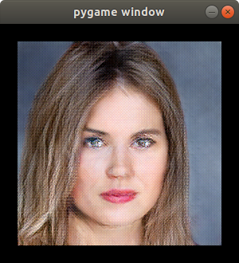
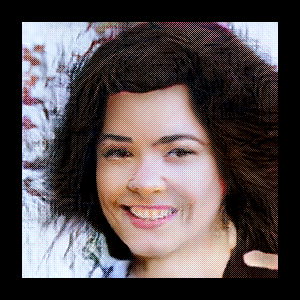

# Adding an AI character generator to pygame



For this tutorial we'll use a pre-trained [HyperGAN](github.com/HyperGAN/HyperGAN) model.

### Download the tflite generator

Download the generator [https://hypergan.s3-us-west-1.amazonaws.com/0.10/tutorial1.tflite](https://hypergan.s3-us-west-1.amazonaws.com/0.10/tutorial1.tflite) (13.9 MB)

```sh
wget https://hypergan.s3-us-west-1.amazonaws.com/0.10/tutorial1.tflite
```

### Load the tflite model

```python
import numpy as np
import tensorflow as tf

# Load TFLite model and allocate tensors.
interpreter = tf.lite.Interpreter(model_path="tutorial1.tflite")
interpreter.allocate_tensors()
```
### Sample the tflite model to a surface
```python

def sample():
  # Get input and output tensors.
  input_details = interpreter.get_input_details()
  output_details = interpreter.get_output_details()

  # Test model on random input data.
  input_shape = input_details[0]['shape']
  latent = (np.random.random_sample(input_shape) - 0.5) * 2.0
  input_data = np.array(latent, dtype=np.float32)
  interpreter.set_tensor(input_details[0]['index'], input_data)

  interpreter.invoke()

  # The function `get_tensor()` returns a copy of the tensor data.
  # Use `tensor()` in order to get a pointer to the tensor.
  result = interpreter.get_tensor(output_details[0]['index'])
  result = np.reshape(result, [256,256,3])
  result = (result + 1.0) * 127.5
  result = pygame.surfarray.make_surface(result)
  result = pygame.transform.rotate(result, -90)
  return result
```

### Render the model

```python
import pygame
pygame.init()
display = pygame.display.set_mode((300, 300))
surface = sample()
```
### Display the surface
```python
running = True

while running:
    for event in pygame.event.get():
        if event.type == pygame.QUIT:
            running = False
    display.blit(surface, (0, 0))
    pygame.display.update()
pygame.quit()
```


### Randomize the latent variable

In the event loop:

```python
if event.type == pygame.KEYDOWN:
    if event.key == pygame.K_SPACE:
      surface = sample()
```

This runs the generator for a new random sample with each press of the space key.





### An issue: this uses the CPU not the GPU.

This technique uses the tflite interpreter which was created for mobile devices.

On desktop, it is not GPU accelerated.  Unanswered question about this here: https://stackoverflow.com/questions/56184013/tensorflow-lite-gpu-support-for-python

### Putting it all together

See [pygame-tutorial.py](pygame-tutorial.py)

## Create your own model

If you want to train a model from scratch, you will need:

* a GPU
* a [HyperGAN](github.com/HyperGAN/HyperGAN) training environment
* a dataset directory of images to train against

### Train your model

```sh
hypergan train [dataset]
```

This will take several hours.  A view will display the training progress.

You will need to save and quit the model when you are satisfied with the results.


### Build the model

```sh
hypergan build
```

This will generate a `tflite` file in your build directory.

### Fine tune your results

There are many differing configurations you can use to train your GAN and each decision will effect the final output.

You can see all the prepacked configurations with:

```sh
hypergan new . -l
```

More information and help can be found in the [discord](https://discord.gg/t4WWBPF).

### References

* https://github.com/tensorflow/tensorflow/blob/master/tensorflow/lite/g3doc/guide/inference.md#load-and-run-a-model-in-python
